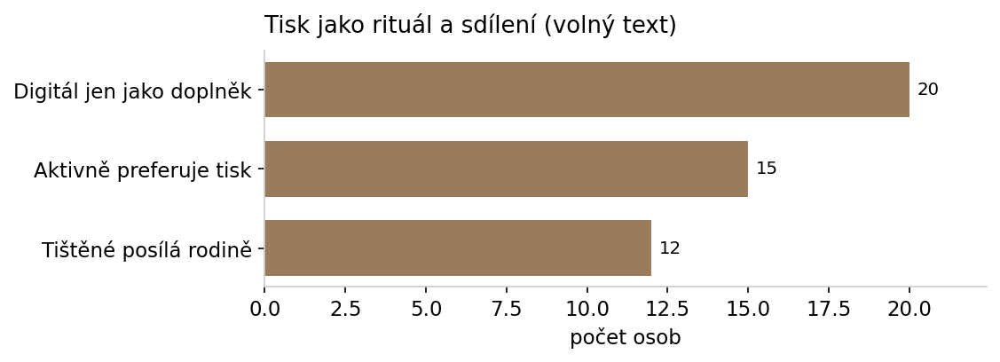
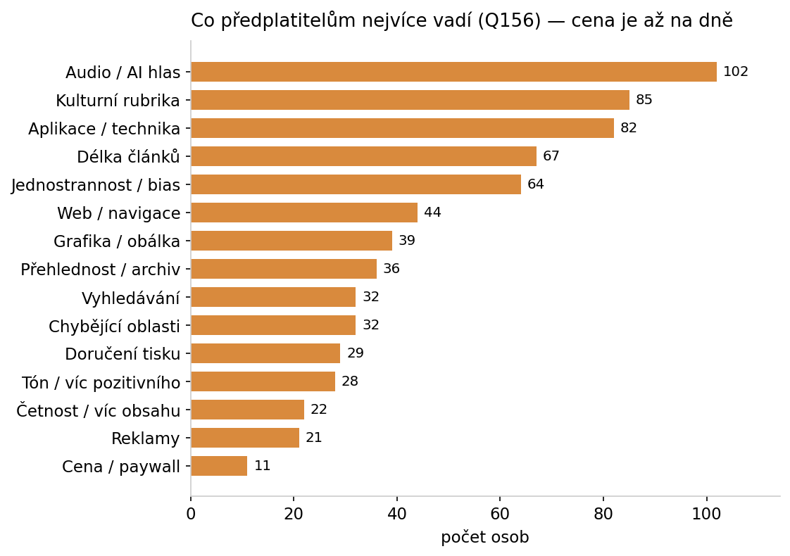
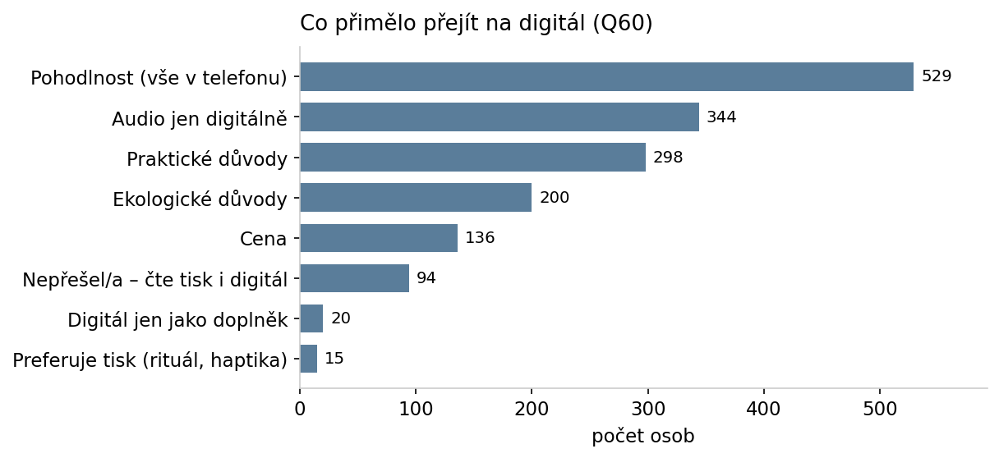

# Klíčová zjištění z předplatitelského průzkumu

**Podklad pro management.** N = 2 139 dokončených odpovědí (export 20. 6. 2026).
Formát: **zjištění → evidence (čísla z průzkumu) → co s tím**. Frekvence z volných textů
jsou přibližné (zachycují jasné formulace). Terminologie genderově neutrální.

---

## Exekutivní shrnutí (1 strana)

**Báze je spokojená a loajální.** 92 % udává vysokou/velmi vysokou pravděpodobnost setrvání,
jen 12,8 % v poslední době uvažovalo o zrušení. Spokojenost s atributy je 90–99 % napříč —
**s jedinou výjimkou: audio**. Kotvou vztahu je **hodnota a kvalita obsahu**, ne cena.

**Riziko není v průměru, ale v rozložení.** Churn se koncentruje do tří míst, která se překrývají:
**první rok předplatného** (17 % vs. 5 % u dlouholetých), **utlumené zapojení** (pasivní digitál
19 % vs. aktivní 10 %) a **mladí muži** (18 %). U mladých mužů odchod **táhne produkt** —
audio a aplikace, ne obsah.

**Tři produktové páky** vystupují konzistentně napříč otázkami: (1) **audio / AI hlas** — jediná
slabina spokojenosti, zároveň největší příležitost (přes tisíc lidí audio nikdy nezkusilo);
(2) **vyhledávání a archiv** — nejkonkrétnější funkční mezera; (3) **přehlednost aplikace**.

**Redakční signály** jsou menšinové, ale hlasité: kultura, vnímaná jednostrannost, „depresivní" tón,
délka článků. **Tisk** přitom není setrvačnost, ale rituál — reálná kotva retence, ne náklad k eliminaci.

**Konkurence** v segmentu je **Deník N** a veřejnoprávní média; publikum je náročné a multi-zdrojové.
Odlišení stojí na **hloubce, kurátorství a překladech**.

**Top 5 doporučení:**
1. **Onboarding prvního roku** — dovést nové předplatitele k návyku (archiv, audio, hloubka).
2. **Aktivace utlumených** — frekvence návštěv jako early-warning; reaktivovat pasivní digitál.
3. **Audio jako priorita** — zlepšit AI hlas a aktivovat ty, kdo audio nezkusili.
4. **Vyhledávání + přehlednost** do app/web roadmapy — rychlé, konkrétní výhry.
5. **Chránit jádro** (obsah, nezávislost, tištěný rituál) a komunikovat hodnotu, ne slevu.

---

## 1. Báze je spokojená a loajální — kotvou je hodnota, ne cena

**Evidence**
- 92 % udává vysokou/velmi vysokou pravděpodobnost setrvání (1 447 „velmi vysoká" + 528 „vysoká");
  jen 12,8 % v poslední době uvažovalo o zrušení.
- Spokojenost s atributy je 90–99 % napříč (množství, délka, výběr i pestrost témat, vyváženost,
  věcnost, přehlednost, užitečnost).
- Chvála (Q155) stojí na **šíři témat (461)**, **hloubce/kontextu (385)** a **kvalitě psaní (370)**.
- Nejčastější *zaškrtnutý* motiv konverze je „podpořit nezávislá média" (1 373), ale nejčastější
  *spontánně psaný* důvod je **kvalita obsahu (151)** a **dlouholetý vztah ke značce (96)**.

**Co s tím**
- Chránit jádro (hloubka, šíře, nezávislost, kvalita psaní) — to drží retenci.
- V akvizici i udržení stavět na **hodnotě a kvalitě**, ne na ceně. Hodnotová podpora je rámec,
  kvalita je spouštěč.

---

## 2. Retence se láme v prvním roce

**Evidence**
- Churn podle délky předplatného: **< 1 rok 17,2 %**, 1–5 let 15,8 %, 6–10 let 12,4 %,
  16–20 let **5,3 %**, 21+ let 8,0 %.
- Noví předplatitelé (151 osob, první rok) jsou nejkřehčí skupina.

**Co s tím**
- **Onboarding prvního roku**: aktivně ukázat hloubku, archiv a audio, dovést k pravidelnému návyku.
- Měřit a cílit retenci právě v prvních 12 měsících — tam uniká nejvíc.

---

## 3. Zapojení = retence; „pasivní digitál" je tichý odchod

**Evidence**
- Pasivní digitál (web i appku používá max. několikrát měsíčně, 178 osob): **churn 19,1 %**.
- Digitální jádro (appku denně / několikrát týdně, 688 osob): **churn 10,2 %**.
- Web vůbec nepoužívá 23–27 % mladších kohort.

**Co s tím**
- Brát **frekvenci návštěv jako early-warning** signál churnu.
- Reaktivovat utlumené předplatitele (newsletter jako vstupní brána, notifikace, audio návyk).

---

## 4. Mladí muži jsou nejrizikovější kohorta — a táhne to produkt, ne obsah

**Evidence**
- Churn podle kohort (věk × pohlaví): **mladší muži 18,3 %**, mladší ženy 13,2 %, starší muži 12,2 %,
  **starší ženy 8,5 %**.
- Mladší muže nejvíc trápí **audio** (21 % „zní uměle") a **UX / ovládání** (16 %).
- „Nic nevadí" řekne jen **5 % mladších mužů** vs. 21 % starších žen — nejkritičtější skupina.

**Co s tím**
- Udržení mladších = **produktové investice** (audio, aplikace, UX), ne další obsah.
- Mladí muži jsou citlivý barometr produktových chyb — sledovat je jako leading indikátor.

---

## 5. Audio je jediná slabina spokojenosti — a zároveň největší příležitost

**Evidence**
- Audio má **nejnižší spokojenost** ze všech atributů: 83 % spokojených (vs. 95–99 % jinde);
  v kohortách 72 % (mladší muži) → 90 % (starší ženy).
- Výtky k audiu/AI hlasu (Q156): **102** (smíšené — část AI kritizuje, část akceptuje); volný text
  přidal +20 zmínek nad checkbox (chybné čtení, výslovnost, jeden hlas pro tazatele i odpovídajícího).
- Zároveň **1 026 lidí** u audia odpovědělo „Nevím" = audio nevyužívají; dalších 119 poslech v appce
  nikdy nezkusilo.

**Co s tím**
- Zlepšit **kvalitu AI hlasu** (výslovnost, rozlišení hlasů v rozhovorech) — řeší konkrétní stížnost.
- **Aktivovat nevyužívající** — největší růstový prostor není přetáhnout ze Spotify, ale přimět
  ke zkoušce ty, kdo audio zatím míjejí.

---

## 6. Vyhledávání a archiv = nejkonkrétnější funkční mezera

**Evidence**
- Vyhledávání: samostatné téma ve výtkách (Q156) **32×**, nevyžádaně v poli „bariéry" **13×**,
  jako přání v aplikaci zaškrtlo **229** lidí.
- Přehlednost / archiv / orientace: 36 výtek (Q156).

**Co s tím**
- **Vyhledávání a orientace v archivu** patří vysoko na app/web roadmapu — je to opakovaný,
  konkrétní a řešitelný požadavek (rychlá výhra).

---

## 7. Tisk není setrvačnost — je to rituál a kotva retence

**Evidence**
- Část předplatitelů digitál **aktivně odmítá**: preferuje tisk (15 — haptika, offline, únava
  z displeje, „pondělní rituál"), digitál jako doplněk (20 — papír doma, audio na cestách).
- „Tištěné posílám rodině" (12) — opakovaný vzorec.

**Co s tím**
- **Nehnat všechny do digitálu.** Tištěný zážitek (rituál, haptika) je reálná kotva retence.
- Potenciál pro **dárkové a rodinné předplatné** (sdílení tisku napříč domácností).

---

## 8. Obsahové výtky míří na kulturu, vnímanou jednostrannost a tón

**Evidence**
- Q156 (redakční témata): **kulturní rubrika 85**, jednostrannost / bias / aktivismus 64,
  délka článků (moc dlouhé) 67, tón / víc pozitivního 28 („depresivní", chybí naděje).
- Stejná osa, opačná valence: **hodnotové souznění** je v chvále (173) i ve výtce (bias 64) —
  proto se valence kódují odděleně.

**Co s tím**
- Redakční reflexe **kultury**, **vyváženosti** a **délky**; vědět, že „bias" je menšinový,
  ale hlasitý a hodnotově nabitý signál — ne plošný problém.

---

## 9. Mladé publikum chce jiný obsah — a akvizici táhne mise + sleva

**Evidence**
- Obsahový profil podle kohort: mladší ženy **reportáže 42 %**, **rodina a vztahy 15 %**, míň politiky;
  mladší muži **politika 44 %**. Starší kohorty víc komentářů a rozhovorů.
- Konverzní motivy mladých: **podpora nezávislých médií 73 %** (vs. 58–61 % starší) a
  **akční nabídka / sleva 22 %** (vs. 9–12 % starší).

**Co s tím**
- Cílený **obsah a marketing pro mladší** (reportáž, témata vztahů/každodennosti vedle politiky).
- **Slevová akvizice funguje na mladé** — ale viz bod 2: bez onboardingu prvního roku je zase ztratíme.

---

## 10. Konkurence je Deník N a veřejnoprávní; publikum je náročné a multi-zdrojové

**Evidence**
- Nejčastější „jiný" sledovaný zdroj: **Deník N 549**, pak iRozhlas / ČRo 414, Seznam Zprávy 403,
  ČT / ČT24 374.
- Předplatitelé běžně kombinují kvalitní domácí + veřejnoprávní + zahraniční zdroje
  (BBC, Economist, NYT, FT…).

**Co s tím**
- Sledovat **Deník N** jako přímého konkurenta v segmentu.
- Odlišení stavět na **hloubce, kurátorství a překladech** zahraničních médií (66 — konkrétní,
  propagovatelná přednost pro akvizici i marketing).

---

# Hlubší zjištění (11–20)

Druhá vrstva — jemnější vzorce a produktové detaily, často kontraintuitivní.

---

## 11. Cena není churn páka — citlivost na cenu je minimální

**Evidence**
- Ve výtkách (Q156) je **cena / paywall jen 11×** — prakticky na dně seznamu 16 témat.
- Sleva jako konverzní motiv je výrazná jen u **mladých a nových** (22 % vs. 9–12 % u starších);
  u jádra báze hraje malou roli.

**Co s tím**
- Cena není důvod odchodu — **zdražení nese menší riziko, než se obvykle předpokládá**, pokud zůstane
  hodnota. Slevu používat cíleně jako akviziční nástroj na mladé, ne plošně.

---

## 12. Publikum chce delší obsah, ne kratší — 80 % preferuje spíše delší texty

**Evidence**
- U textů preferuje **spíše delší 67 %**, spíše kratší jen 17 %, bez preference 16 % — tj.
  **4 z 5 lidí s názorem chtějí delší** (u audioverzí 64 %, podcastů 61 % z těch s názorem).
- Proti tomu je „délka článků (moc dlouhé)" ve výtkách jen 67 zmínek = **hlasitá menšina**.

**Co s tím**
- **Nepřeklápět produkt ke krátkému obsahu.** Hloubka je hodnota, ne slabina; zkracovat selektivně,
  ne plošně. U videa naopak prostor pro kratší formát.

---

## 13. Kdo odchází kvůli obsahu, vadí mu jednostrannost a tón — ne produkt

**Evidence**
- Mezi těmi, kdo uvažují o zrušení (274), jsou nadprůměrně zastoupené výtky na
  **vnímanou jednostrannost / bias** (6 % vs. 3 % v celku), **délku**, **kulturní rubriku**
  a **„depresivní" tón** — vedle audia.
- Vznikají tak **dvě odlišné churn-pružiny**: produktová (mladí muži — audio, app, bod 4)
  a **hodnotově-redakční** (vnímaná jednostrannost, tón).

**Co s tím**
- Retenční komunikace a redakční reflexe musí **mířit na obě osy zvlášť** — produktové opravy
  neudrží toho, kdo odchází kvůli vnímané jednostrannosti, a naopak.

---

## 14. Homepage není vstupní bod — distribuce běží přes newsletter, sítě, RSS

**Evidence**
- Q73: část přichází na obsah přes **externí odkaz** (newsletter / mail, sociální sítě, RSS,
  QR z tisku — 15) nebo homepage prakticky nepoužívá (8).

**Co s tím**
- Brát **newsletter a sociální sítě jako reálnou vstupní bránu** k obsahu, ne jen doplněk —
  investovat do nich jako do distribučního kanálu, ne marketingové ozdoby.

---

## 15. Audio a offline jsou tahouny přechodu na digitál

**Evidence**
- Důvody přechodu na digitál (Q60): pohodlnost (vše v telefonu) 529, **audio dostupné jen
  digitálně 344**, praktické (zahraničí / nestíhám fyzicky) 298, ekologie 200, cena 136.
- **Offline** je silné přání: stáhnout vydání a číst offline zaškrtlo 366, „lepší offline režim" 93.

**Co s tím**
- **Audio a offline čtení = on-ramp na digitál.** Propagovat je jako důvod vyzkoušet appku;
  doladit offline režim (opakované přání).

---

## 16. Přístupnost (velikost písma) je snadná výhra vzhledem k věku

**Evidence**
- Nevyžádaně v poli „co chybí v aplikaci": **přístupnost** (velikost písma/fontů, zoom obrázků,
  čtení bez brýlí) 10× — bez nabídnutého checkboxu.
- Věkový profil báze je starší (většina 45+), takže dopad je nadproporční.

**Co s tím**
- **Nastavitelná velikost písma a zoom obrázků** je low-effort / high-fit zásah do appky.

---

## 17. Top přání v aplikaci: odlišit přečtené, offline, vlastní playlist

**Evidence**
- Nejčastější přání (checkboxy): **výraznější odlišení přečteného/poslouchaného 251**,
  offline stažení vydání 366, otevírat články ze sítí v appce 126, vlastní audio playlist 120,
  CarPlay / Android Auto 118.
- Plus z volného textu: přehlednost UI (12), výkon/stabilita (10).

**Co s tím**
- Konkrétní app roadmapa: **orientace ve vydání** (co už jsem četl/poslechl), **offline**,
  **audio playlist** a **CarPlay** — vše opakovaně žádané.

---

## 18. Poslech v aplikaci prohrává s agregátory — cíl jsou ti, kdo nezkusili

**Evidence**
- Q153: hlavní důvod, proč ne appka, **není chyba** — lidé už mají **jinou platformu** (Spotify/Apple,
  126) a **zvyk** (30), hlavně kvůli **agregaci všech podcastů na jednom místě** (65).
- **119 lidí** poslech v appce vůbec nezkusilo; skutečné technické problémy (21) jsou menšina.

**Co s tím**
- **Nepřetahovat ze Spotify** (těžké). Realistický cíl je **119 nevyzkoušejících** + nabídnout to,
  co agregátor neumí (návaznost na text, sledování přehraného).

---

## 19. Loajalita stojí na dvou různých osách: důvěra/fakta vs. vyváženost/objektivita

**Evidence**
- Po retaxonomizaci chvály (Q155) se „důvěra/věrohodnost/vyváženost" rozpadla na dvě odlišné věci:
  **důvěra / ověřená fakta (194)** a **vyváženost / objektivita / nestrannost (170)**.
- Jsou to **dva různé důvody** loajality — serióznost vs. nestrannost úhlů.

**Co s tím**
- V komunikaci značky **nezaměňovat** „věříme faktům" a „dáváme různé úhly" — rezonují u různých lidí.
  Vyváženost je navíc tatáž osa, kterou jiná skupina kritizuje jako bias (bod 13).

---

## 20. Drobné, ale opakované značkové signály: obálka a „depresivní" tón

**Evidence**
- Grafika / obálka / ilustrace 39 výtek — **opakované „chybí Reisenauer"**.
- Tón / víc pozitivního 28 — „depresivní", chybí naděje a řešení.

**Co s tím**
- Vizuální identita (obálka, ilustrace) má **emoční vazbu ke značce** — drobnost s velkým ohlasem.
- Zvážit **konstruktivní / řešení-orientovaný** obsah jako protiváhu vnímané depresivnosti
  (souvisí s churn-pružinou v bodě 13).

---

*Zdroje: `respekt_analyticky.csv` (2 139 × 294), kódování otevřených otázek Q153–Q156,
kohortové a segmentové křížové analýzy (viz interaktivní dashboard `dashboard/`).
Detailní per-otázkové výsledky kódování volných polí jsou v `SOUHRNY.md`.
Grafy se generují skriptem `python3 charts/make_charts.py` z `dashboard/data.json`.*
