<!-- .slide: data-background-color="#222222" -->

PŘEDPLATITELSKÝ PRŮZKUM

<h1>Klíčová zjištění</h1>

N = 2 139 dokončených odpovědí · export 20. 6. 2026

## 1 · Báze je spokojená a loajální — kotvou je hodnota, ne cena

- 92 % udává vysokou/velmi vysokou pravděpodobnost setrvání; jen **12,8 %** zvažovalo odchod
- Spokojenost s atributy je **90–99 %** napříč
- Chvála stojí na šíři témat (461), hloubce (385), kvalitě psaní (370)

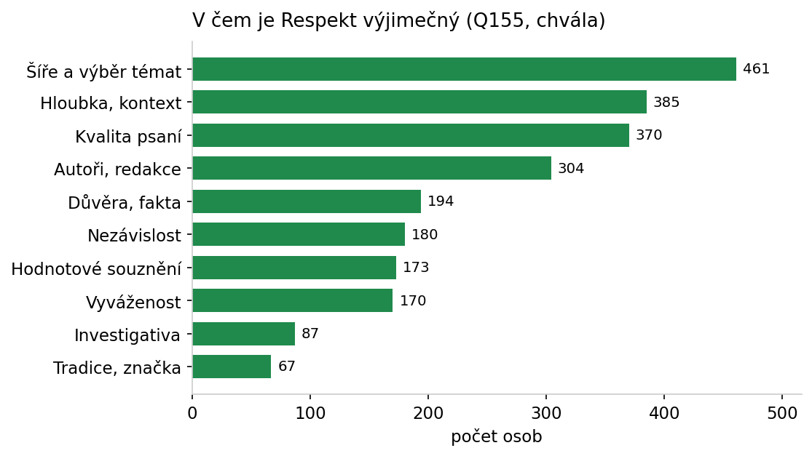

> Chránit jádro (hloubka, šíře, nezávislost, kvalita psaní) a komunikovat hodnotu, ne slevu.

---

## 2 · Retence se láme v prvním roce

- Churn **< 1 rok 17 %** a 1–5 let 16 % vs. 16–20 let jen **5 %**
- Noví předplatitelé (151) jsou nejkřehčí fáze

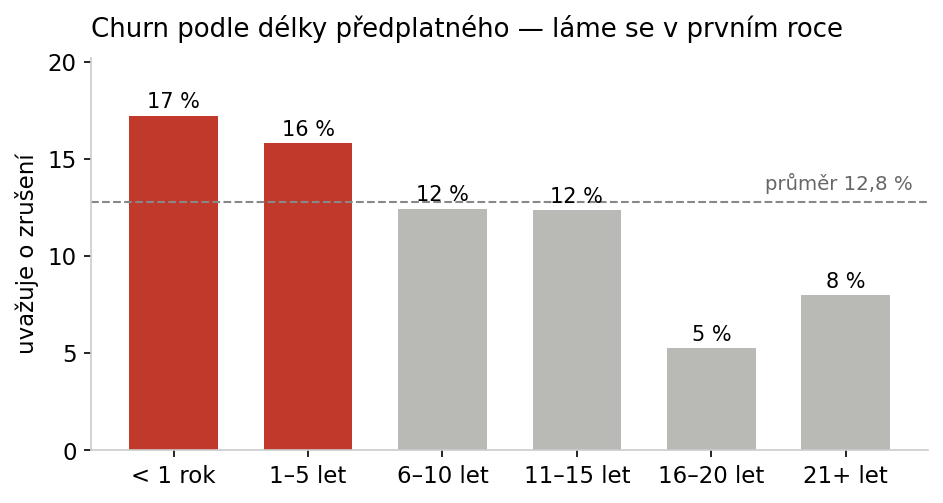

> Onboarding prvního roku — dovést k návyku (archiv, audio, hloubka). Měřit retenci v prvních 12 měsících.

---

## 3 · Zapojení = retence; pasivní digitál je tichý odchod

- Pasivní digitál (178): churn **19 %** vs. digitální jádro (688): **10 %**
- Web vůbec nepoužívá 23–27 % mladších kohort

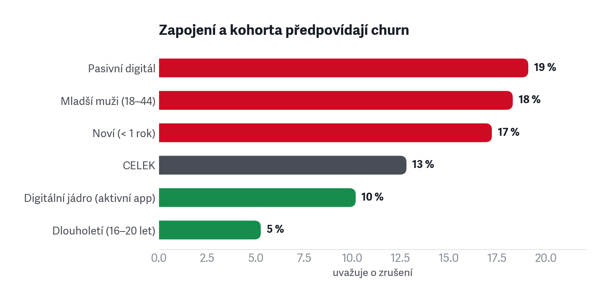

> Frekvenci návštěv brát jako early-warning churnu; reaktivovat utlumené (newsletter, notifikace, audio).

- DODEFINOVAT PASIVNÍ DIGITÁL
- PŘIDAT DO GRAFU PRINT?

---

## 4 · Mladší muži jsou nejrizikovější kohorta — táhne to produkt

- Churn mladší muži **18 %** vs. starší ženy **8,5 %**
- Nejvíc je trápí audio (21 %) a UX / ovládání (16 %)
- „Nic nevadí" řekne jen 5 % mladších mužů — nejkritičtější

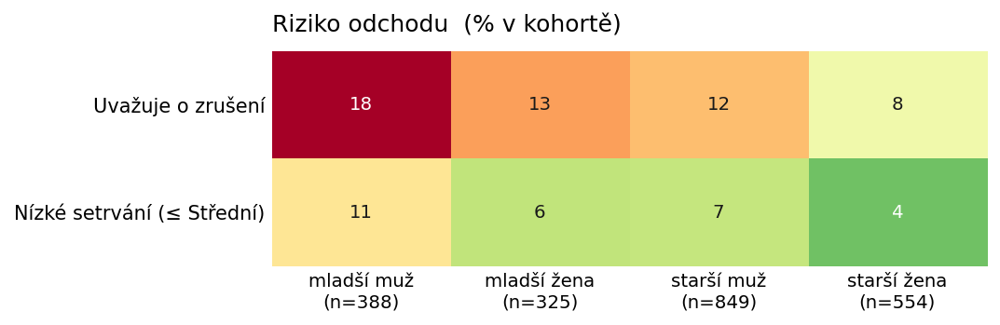

> Udržení mladších = produktové investice (audio, aplikace, UX), ne další obsah.

---

## 5 · Audio jako slabina spokojenosti

- Audio nejnižší spokojenost: **83 %** (mladší muži 72 %) vs. 95–99 % jinde
- Výtky k audiu / AI hlasu 102; volný text přidal +20 zmínek
- 1 026 lidí audio nevyužívá; dalších 119 poslech v appce nezkusilo

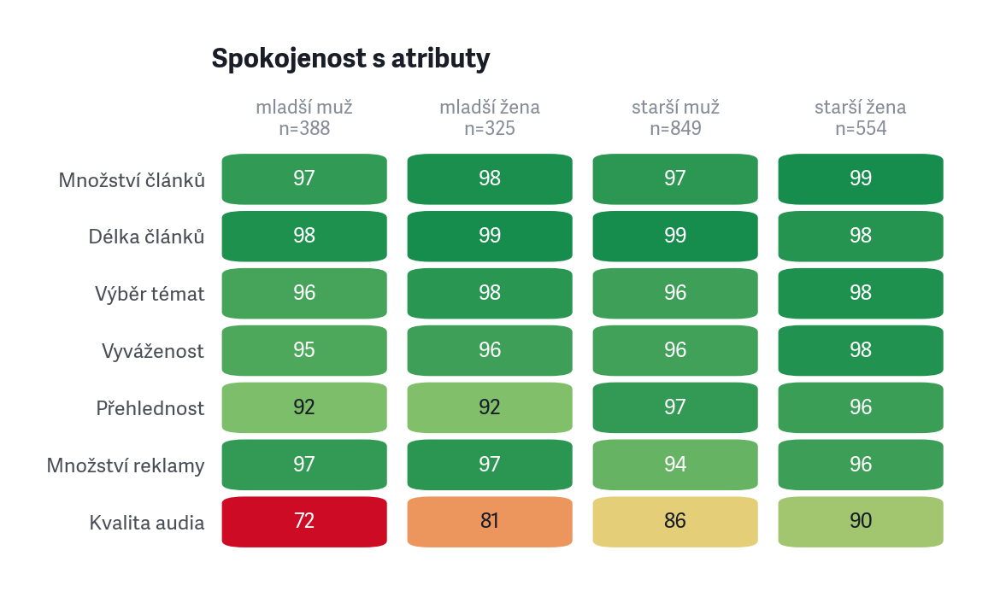

> Zlepšit kvalitu AI hlasu (výslovnost, rozlišení hlasů) a aktivovat ty, kdo audio zatím míjejí.
- MIXUJÍ SE TAM STÍŽNOSTI NA VÝSLOVNOST V PODCASTECH
- Jeden z vašich hlasů, ženský, který často používáte na hlavní témata, má v pozadí vysokofrekvenční zvuk, který z toho dělá neposlouchatelnou věc. Slyším to v autě i ve sluchátcích a už hodně dlouho, nemyslím si, že to je problém na mojí straně
- ČASTO ŘEŠÍ UŽ VYŘEŠENÉ - CHYBĚJÍCÍ TEXTY (AUDIOTÉKA?), STŘÍDÁNÍ HLASŮ V ROZHOVORECH, V2, 
- ODLIŠENÍ KONCE A ZAČÁTKU, DLOUHÉ PAUZY, ZMĚNY HLASU NA ZAČÁTKU ODSTAVŮC
---

## 6 · Vyhledávání a archiv = nejkonkrétnější funkční mezera

- Vyhledávání: výtka 32×, nevyžádaně v bariérách 13×, přání v appce **229**
- Přehlednost / archiv / orientace: 36 výtek

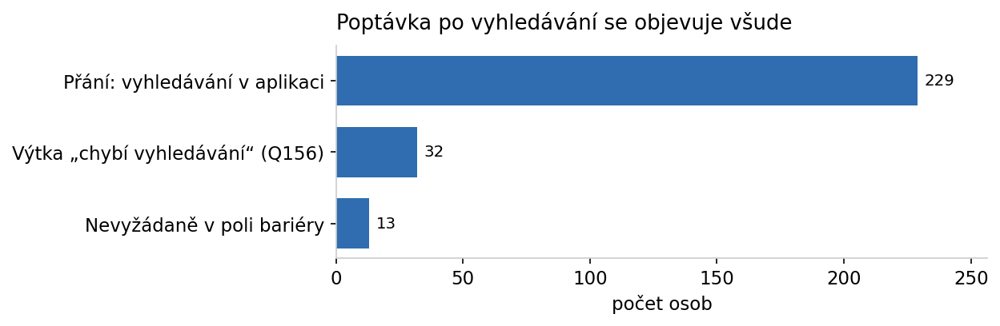

> Vyhledávání a orientaci v archivu vysoko na app/web roadmapu — opakovaná a řešitelná rychlá výhra.

- VYHLEDÁVÁNÍ PŘIDAT RICE VÝŠ, DEEPLINKY
- ZVÁŠŽIT FUNKCI LANDING PAGE Z IG V APP
- 

---

## 7 · Tisk není setrvačnost — je to rituál a kotva retence

- Část digitál aktivně odmítá: preferuje tisk (15), digitál jako doplněk (20)
- „Tištěné posílám rodině" (12) — opakovaný vzorec

> Nehnat všechny do digitálu; chránit tištěný zážitek. Potenciál pro dárkové a rodinné předplatné.

- TADY PŘIDAT I NĚCO Z UZAVŘENÝCH ODPOVĚDÍ
- KLUB - RODIČOVSKÉ

---

## 8 · Obsahové výtky míří na kulturu, jednostrannost a tón

- Kulturní rubrika 85, jednostrannost / bias 64, délka 67, tón 28
- Hodnotové souznění je v chvále (173) i ve výtce (bias 64) — stejná osa, opačná valence

> Redakční reflexe kultury, vyváženosti a délky; „bias" je menšinový, ale hlasitý a hodnotově nabitý signál.

- TOHLE JEŠTĚ VZTÁHNOUT K UZAVŘENÝM - DORUČOVÁNÍ MENŠÍ, DÉLKA ČLÁNKŮ ASI TAKY NEODPOVÍDÁ

---

## 9 · Mladé publikum chce jiný obsah; akvizici táhne mise + sleva

- Mladší ženy: reportáže 42 %, rodina a vztahy 15 %, míň politiky; mladší muži politika 44 %
- Konverze mladých: podpora médií 73 % a sleva 22 % (vs. 9–12 % u starších)

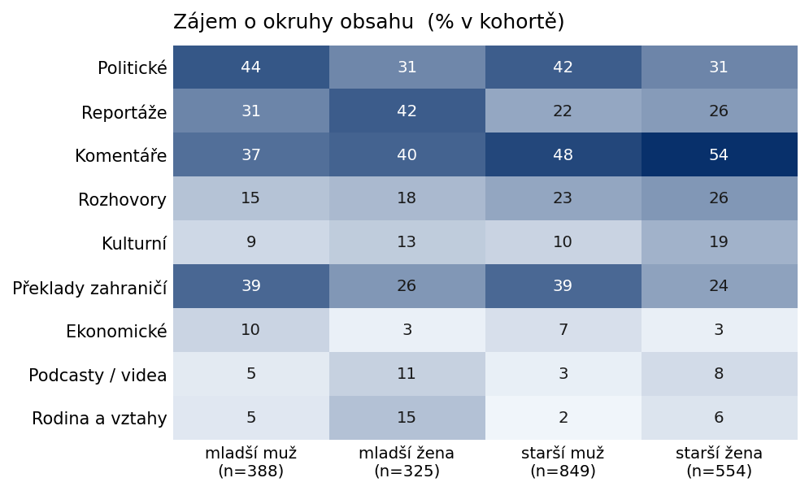

> Cílený obsah a marketing pro mladší; slevová akvizice funguje, ale bez onboardingu prvního roku je ztratíme.

---

## 10 · Konkurence je Deník N a veřejnoprávní; publikum je náročné

- Nejčastější jiný zdroj: Deník N **549**, iRozhlas 414, Seznam 403, ČT 374
- Předplatitelé kombinují domácí + veřejnoprávní + zahraniční zdroje

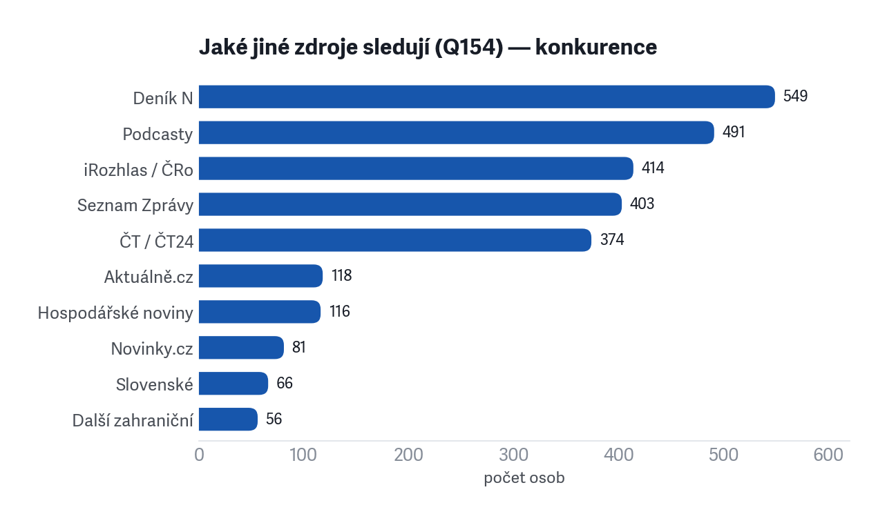

> Sledovat Deník N jako přímého konkurenta; odlišení stavět na hloubce, kurátorství a překladech (66).

---

<!-- .slide: data-background-color="#222222" -->

11–20 · JEMNĚJŠÍ VZORCE A PRODUKTOVÉ DETAILY

<h1>Hlubší zjištění</h1>

---

## 11 · Cena není churn páka — citlivost na cenu je minimální

11×

- Cena / paywall ve výtkách jen **11×** — prakticky na dně 16 témat
- Sleva jako konverzní motiv hraje roli hlavně u mladých a nových

> Zdražení nese menší riziko, než se obvykle čeká, pokud zůstane hodnota. Slevu cíleně na mladé, ne plošně.

- TOHLE JEŠTĚ VZTÁHNOUT K UZAVŘENÝM

---

## 12 · Publikum chce delší obsah, ne kratší

- U textů: **67 % spíše delší**, jen 17 % kratší → 4 z 5 lidí s názorem chtějí delší
- Audioverze 64 %, podcasty 61 % (z těch s názorem)

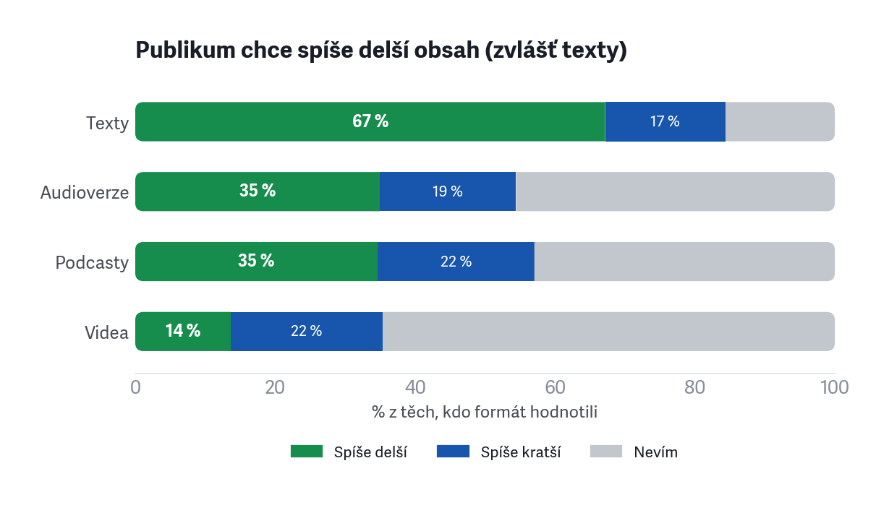

> Nepřeklápět produkt ke krátkému obsahu; zkracovat selektivně. U videa naopak prostor pro kratší formát.

---

## 13 · Kdo odchází kvůli obsahu, vadí mu jednostrannost a tón

- Churneři over-index: bias **6 vs. 3 %**, dále délka, kultura, tón
- Dvě churn-pružiny: produktová (mladší muži) a hodnotově-redakční

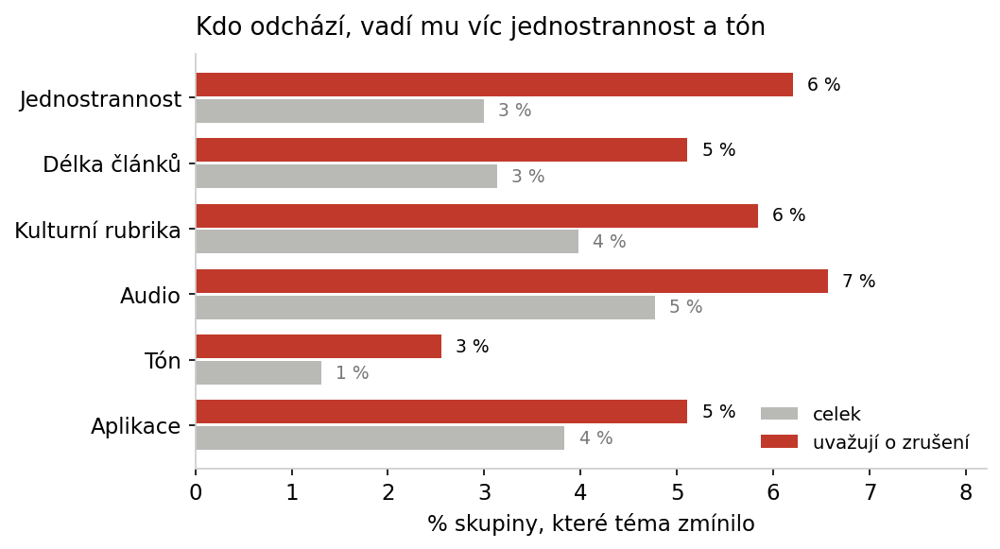

> Retence musí mířit na obě osy zvlášť — produktové opravy neudrží toho, kdo odchází kvůli vnímané jednostrannosti.

- DIVNÝ SLOVNÍK

---

## 14 · Homepage není vstupní bod — distribuce přes newsletter a sítě

15 + 8

- Část přichází přes externí odkaz (newsletter, sítě, RSS, QR z tisku) — 15
- Část homepage prakticky nepoužívá — 8 (jde rovnou na audio, RSS, papír)

> Brát newsletter a sociální sítě jako distribuční kanál, ne marketingovou ozdobu — investovat do nich.

- STOJÍ JEN NA OTEVŘENÝCH?

---

## 15 · Audio a offline jsou tahouny přechodu na digitál

- Důvody přechodu: pohodlí 529, **audio jen digitálně 344**, praktické 298, ekologie 200
- Offline: stáhnout vydání 366, „lepší offline režim" 93

> Audio a offline čtení = on-ramp na digitál; propagovat je jako důvod vyzkoušet appku, doladit offline režim.

- CO JSOU PRAKTICKÉ DŮVODY
- NEPŘEŠEL VYHODIT A DALŠÍ TAKY
- SLOVNÍK
- VZTAH K 17

---

## 16 · Přístupnost (velikost písma) je snadná výhra vzhledem k věku

45+

- Nevyžádaně: přístupnost (velikost písma, zoom, čtení bez brýlí) **10×**
- Věkový profil báze je starší — dopad je nadproporční

> Nastavitelná velikost písma a zoom obrázků = low-effort / high-fit zásah do aplikace.

- MALÝ VZOREK?

---

## 17 · Top přání v aplikaci: odlišit přečtené, offline, vlastní playlist

- Odlišení přečteného **251**, offline 366, otevírat ze sítí 126, playlist 120, CarPlay 118
- Z volného textu: přehlednost UI (12), výkon / stabilita (10)

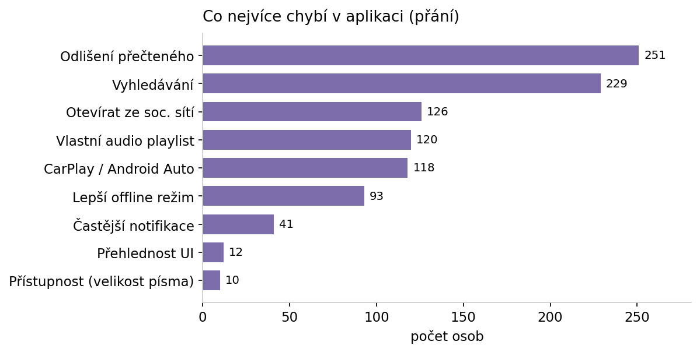

> App roadmapa: orientace ve vydání (co už jsem četl), offline, audio playlist a CarPlay.

- MOC TOHO CARPLAY?

---

## 18 · Poslech v aplikaci prohrává s agregátory — cíl jsou ti, kdo nezkusili

- Důvod není chyba: jiná platforma (Spotify/Apple) 126, zvyk 30, agregace 65
- **119 lidí** poslech v appce vůbec nezkusilo; tech. problémy (21) jsou menšina

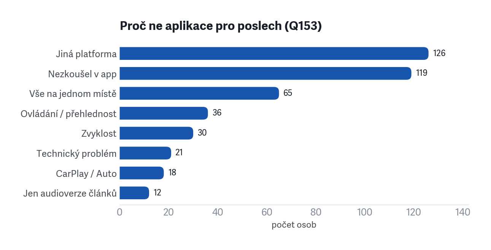

> Nepřetahovat ze Spotify; cílit na 119 nevyzkoušejících a nabídnout, co agregátor neumí (návaznost na text).

---

## 19 · Loajalita stojí na dvou osách: důvěra/fakta vs. vyváženost

194 : 170

- Důvěra / ověřená fakta (194) a vyváženost / objektivita (170) jsou dva různé důvody
- Serióznost vs. nestrannost úhlů — rezonují u různých lidí

> V komunikaci nezaměňovat „věříme faktům" a „dáváme různé úhly"; vyváženost je táž osa, kterou jiní kritizují jako bias.

---

## 20 · Drobné, ale opakované značkové signály: obálka a tón

39 + 28

- Grafika / obálka / ilustrace 39 — opakované „chybí Reisenauer"
- Tón / víc pozitivního 28 — „depresivní", chybí naděje a řešení

> Vizuální identita má emoční vazbu ke značce; zvážit konstruktivní / řešení-orientovaný obsah jako protiváhu.

- OPATRNĚJŠÍ FORMULACE

---

## 21 · Co přimělo k předplatnému — mise táhne všechny kohorty

- „Podpořit nezávislá média": **73,7 % mladší muž, 72,0 % mladší žena** — nejsilnější motiv
- Akční nabídka / sleva výrazně silnější u mladších (22 %) než u starších (8–12 %)
- Doporučení od známého: vyšší u mladších (10–14 %) → peer efekt funguje

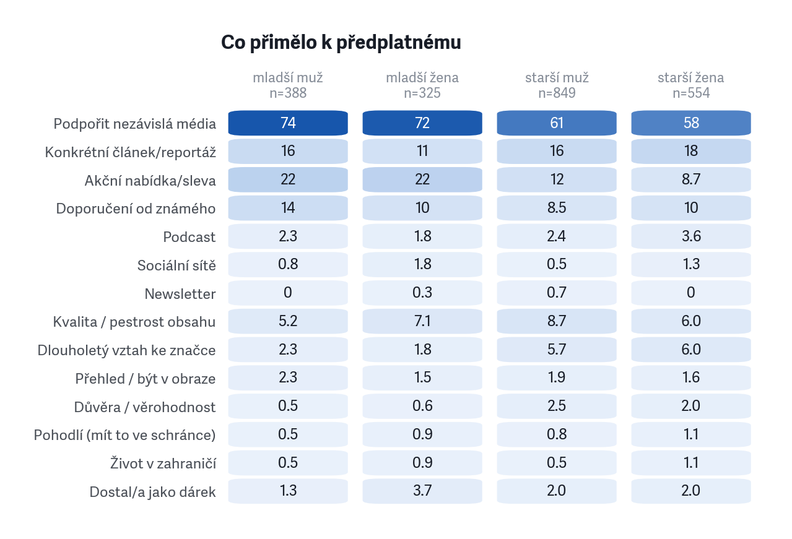

> Akvizice stojí na misijním argumentu pro všechny; slevu cílit na mladé, referral program rozvíjet jako kanál.

---

## 22 · Co jim na Respektu vadí — profil výtek podle kohorty

- „Nic nevadí": starší ženy **20,8 %** vs. mladší muži jen **5,4 %** — nejkritičtější kohorta
- Audio / AI hlas: mladší muži 7,7 % a mladší ženy 7,4 % — 2× více než u starších
- Aplikace / technika: mladší muži 6,7 % vs. starší ženy 1,4 %
- Vyhledávání: neobvyklý spike mladší ženy 4,9 % (vs. 0,4–1,4 % jinde)

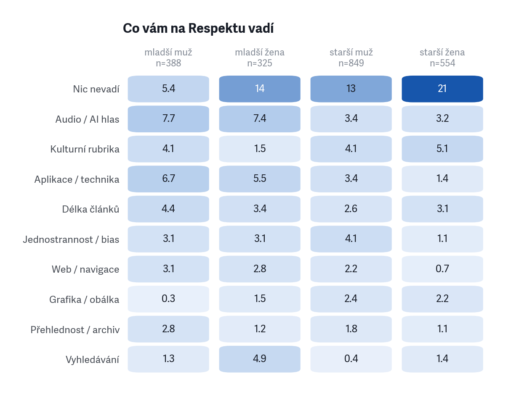

> Produktové opravy (audio, aplikace, vyhledávání) jsou téma mladší kohorty; starší ženy jsou nejspokojenější.

---

## 23 · Bariéry při čtení/poslechu — audio a UX jsou mladší problém

- Nejčastější bariéra: **Nepřišlo včas 17–19 %** — rovnoměrně napříč kohortami (problém distribuce, ne segmentu)
- Audio zní uměle: mladší muži **21 %**, mladší ženy **19 %** vs. starší ~10 %
- UX / ovládání: mladší muži 16 %, u starší ženy jen 4 %

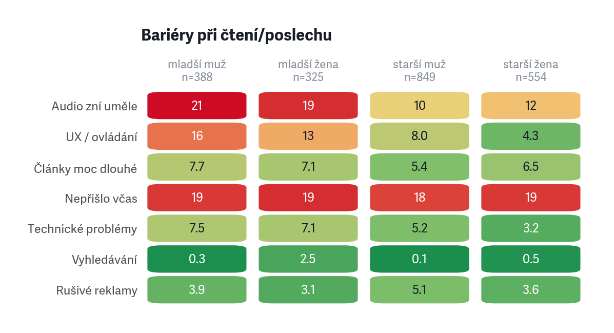

> „Nepřišlo včas" = tiskový výtisk nedorazil do schránky — systémový doručovací problém bez věkového profilu. Audio a UX jsou naopak generační výzva.

---

## 24 · Reklama — konkrétní stížnost, malá škála

103×

- Rušivé reklamy (bariéra checkbox): **90 osob (4,2 %)** — nejčastější signál
- Nespokojenost s množstvím reklamy (škála): 72 / 1 582 (4,5 % z těch, co odpověděli)
- Q156 výtka „reklamy": **21 osob (1,0 %)** — na dně 16 témat
- Vyskakovací / self-promo bannery zmíněny výslovně v textu: ~5 lidí

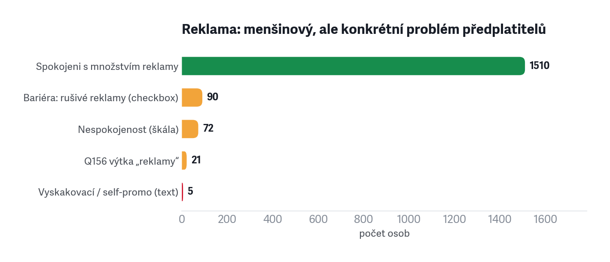

> Signál je malý, ale konkrétní: **předplatitelé nechápou, proč jim jako platícím zákazníkům vyskakují bannery na vlastní akce Respektu.** Vypnutí self-promo pro přihlášené je nízkonákladová výhra.

---

## 25 · Chyby v textech — korektura obsahu je vzorná; audio zaostává

370 × 4

- Q155 chvála „Kvalita psaní / jazyk / úroveň": **370 zmínek** — 3. nejčastěji chválená věc
- Gramatika / překlepy v textu (Q156): pouze **4 zmínky**
- Audio chyby výslovnosti / AI hlas: **102 zmínek** — 26× více než text

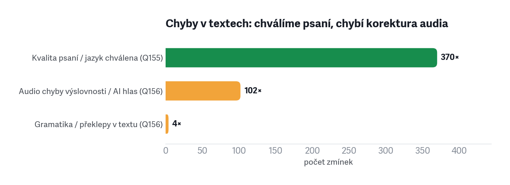

> Redakce si drží vysoký jazykový standard — čtenáři to oceňují. Korekturní pozornost přenést na AI čtení: tam je chybovost vnímána silně a opakovaně.

---

## 26 · Koreláty rizika odchodu — redakční osy předčí produktové

- Nejsilnější signál: **nespokojenost s výběrem témat** (+11,8 pp mezi churners vs. zbytek)
- **Vyváženost / objektivita** těsně za ní (+10,8 pp) — stejná osa, stejný riskantní segment
- Produktové problémy (délka, audio, UX) jsou reálné, ale efekt je menší (+5–7 pp)
- **Tisk nepřišel včas** (+5,0 pp) — i distribuční výpadek koreluje s churnEM

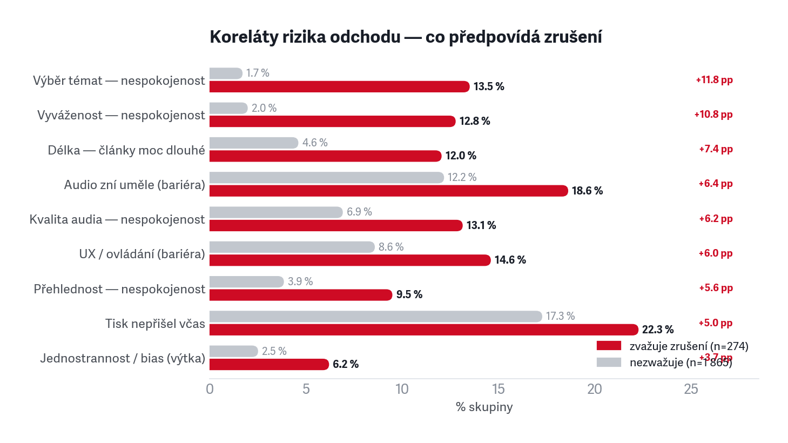

> Dvě osy churnu jsou nezávislé: produktová (opravitelná) a redakční/hodnotová (výběr témat, vyváženost — nelze vyřešit featury). Retence musí adresovat obě zvlášť.

---

## Exekutivní shrnutí

- **Báze je spokojená a loajální** — 92 % vysoké setrvání, jen 12,8 % zvažuje odchod. Kotvou je hodnota a kvalita, ne cena.
- **Riziko je v rozložení, ne v průměru** — churn se koncentruje: první rok (17 %), pasivní digitál (19 %), mladší muži (18 %).
- **Tři produktové páky** — audio / AI hlas, vyhledávání a archiv, přehlednost aplikace.
- **Redakční signály** jsou menšinové, ale hlasité — kultura, vnímaná jednostrannost, „depresivní" tón, délka.

> **Top 5:** 
> - onboarding 1. roku 
> - aktivace pasivních (frekvence = early-warning) 
> - audio 
> - vyhledávání + přehlednost 
> - chránit jádro a komunikovat hodnotu.

---

<!-- .slide: data-background-color="#222222" -->

<h1>Tři priority do akce</h1>
<ol>
<li><strong>Udržet nové a utlumené</strong> — onboarding 1. roku + aktivace pasivního digitálu; frekvence jako early-warning.</li>
<li><strong>Produktové páky</strong> — audio / AI hlas, vyhledávání a archiv, přehlednost aplikace.</li>
<li><strong>Chránit jádro a hodnotu</strong> — hloubka, nezávislost, tištěný rituál; komunikovat hodnotu, ne slevu.</li>
</ol>

