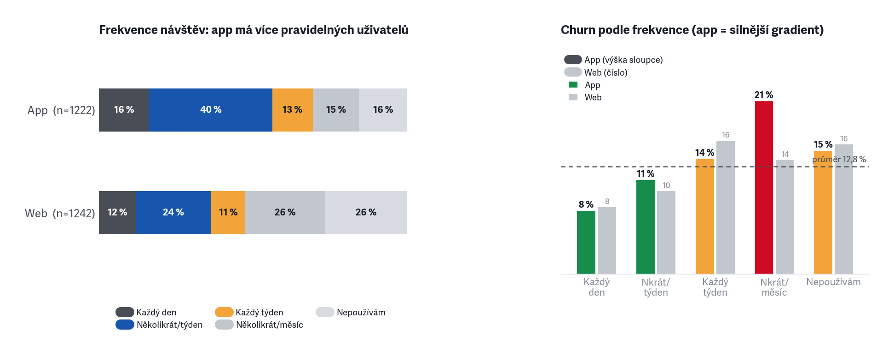
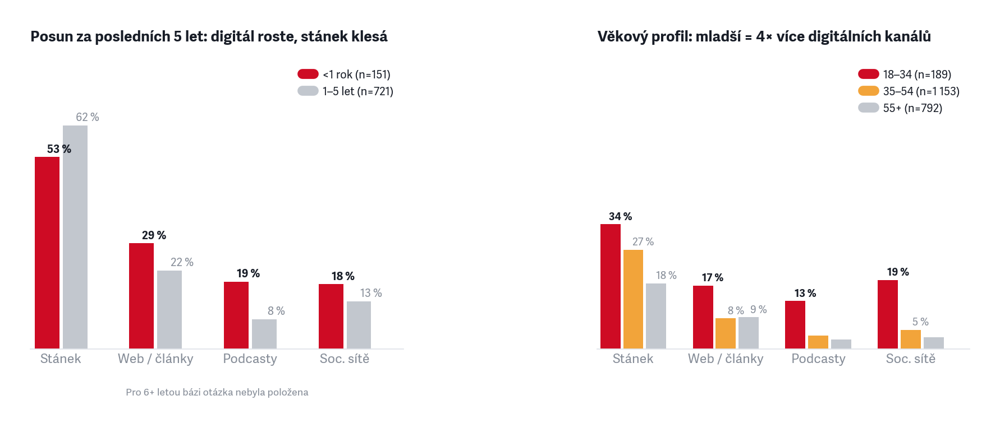

<!-- .slide: data-background-color="#222222" -->

PŘEDPLATITELSKÝ PRŮZKUM

<h1>Klíčová zjištění</h1>

N = 2 139 dokončených odpovědí · export 20. 6. 2026

---

<!-- .slide: class="two-col" -->
## 1 · Předplatitelé jsou spokojení a loajální — kotvou je hodnota, ne cena

- 92 % udává vysokou/velmi vysokou pravděpodobnost setrvání; jen **12,8 %** zvažuje odchod
- Spokojenost s atributy je **90–99 %** napříč
- Chvála stojí zejména na šíři témat (461), hloubce (385), kvalitě psaní (370)

> Chránit jádro (hloubka, šíře, nezávislost, kvalita psaní) a komunikovat hodnotu, ne slevu.

---

<!-- .slide: class="two-col" -->
## 2 · Retence se láme v prvním roce

- Churn **< 1 rok 17 %** a 1–5 let 16 % vs. 16–20 let jen **5 %**
- Noví předplatitelé (151) jsou nejkřehčí segment

> Onboarding 1. roku — dovést k návyku (aplikace, notifikace, audio, newslettery). Zaměřit se na retenci v prvních 12 měsících.

---

<!-- .slide: class="two-col" -->
## 3 · Zapojení = retence; pasivní digitál je tichý odchod

- **Pasivní digitál** (178): digitální předplatitelé bez pravidelné návyku — web i app max několikrát/měsíc; churn **19 %**
- Digitální jádro (aktivní app, 688): churn **10 %** — poloviční riziko
- **Předplatné s tiskem** (94): churn jen **4 %** — tisk jako kotva

> Trend frekvence návštěv segmentu sledovat jako riziko churnu. Reaktivovat utlumené (newsletter, notifikace, audio). Připomínat se, jaký obsah minuli.

---

<!-- .slide: class="two-col" -->
## 4 · Mladší muži jsou nejrizikovější kohorta

- Churn mladší muži **18 %** vs. starší ženy **8,5 %**
- Nejvíc je trápí audio (21 %) a UX / ovládání (16 %)
- „Nic nevadí" řekne jen 5 % mladších mužů

> Udržení mladších = produktové investice do aplikace, ne další obsah.

---

<!-- .slide: class="two-col" -->
## 5 · Koreláty rizika odchodu — redakční osy předčí produktové

- Nejsilnější signál: **nespokojenost s výběrem témat** (+11,8 pp mezi churners vs. zbytek)
- **Vyváženost / objektivita** těsně za ní (+10,8 pp) — stejná osa, stejný riskantní segment
- Produktové problémy (délka, audio, UX) jsou reálné, ale efekt je menší (+5–7 pp)
- **Tisk nepřišel včas** (+5,0 pp) — i distribuční výpadek koreluje s churnem

> Dvě osy churnu jsou nezávislé: produktová (opravitelná) a redakční/hodnotová (výběr témat, vyváženost — nelze vyřešit featury). Retence musí adresovat obě zvlášť.

---

<!-- .slide: class="two-col" -->
## 6 · Kdo odchází kvůli obsahu, vadí mu jednostrannost a tón

- Odpadlíci: jednostrannost **6 vs. 3 %**, dále délka, kultura
- Dvě odpadlické osy: produktová (mladší muži) a hodnotově-redakční

> Retence musí mířit na obě osy zvlášť — produktové opravy neudrží toho, kdo odchází kvůli vnímané jednostrannosti.

---

<!-- .slide: class="two-col" -->
## 7 · Tisk je rituál a kotva retence

- **88 %** předplatitelů tisku stabilně čte papírové vydání — tradice, ne náhoda
- Spokojenost s doručováním **85 %** (hodnocení 4–5/5, n = 1 279)
- Velká část digitál **aktivně odmítá**: „pondělní rituál s kávou", únava z obrazovky
- Digitál je pro mnohé **doplněk, ne náhrada**: doma papír, na cestách digitál/audio (20 zmínek)
- „**Tištěné posílám rodičům**" — opakovaný vzorec (12)

> Nehnat všechny do digitálu; chránit tištěný zážitek. Potenciál pro dárkové a rodinné předplatné v Klubu.

---

<!-- .slide: class="two-col" -->
## 8 · Audio a offline jsou tahouny přechodu na digitál

- Pohodlnost (vše v telefonu): **529** · Audio jen digitálně: **344** · Ekologie: 200 · Cena levnější: 136
- **Praktické důvody** (298) = bydlím v zahraničí, nestíhám číst fyzicky
- Offline: stáhnout vydání 366, „lepší offline režim" 93

> Audio a offline čtení propagovat jako důvod vyzkoušet appku. Investovat do app.

---

<!-- .slide: class="two-col" -->
## 9 · Aplikace, nejsilnější nástroj budování návyku

- App má výrazně více pravidelných uživatelů: **56 % Několikrát/týden** vs. web 36 %
- Odpadovost v app je strmá: **denní 7,5 %** → **měsíční 20,7 %** (2,8× rozdíl); u webu je to plošší
- App = analogie tiskovému rituálu v digitálu — pravidelnost chrání retenci

> Dostat předplatitele do denní/týdenní frekvence v appce → silnější ochrana před odpadnutím. App jako primární platforma pro budování návyku (archiv, audio, offline, notifikace).

---

<!-- .slide: class="two-col" -->
## 10 · Audio jako slabina spokojenosti

- Audio vykazuje nejnižší spokojenost: **83 %** (mladší muži 72 %) vs. 95–99 % u jiných parametrů
- Výtky k audiu / AI hlasu 102; volný text přidal +20 zmínek
- 1 026 lidí audio nevyužívá; dalších 119 nezkusilo poslech v naší aplikaci
- Zkreslené výsledky: výslovnost v podcastech a faktor Audiotéka (neopravené texty, zpoždění, omezený obsah).

> Zlepšit kvalitu AI hlasu (zrušit Anetu? upravit předěly?). Aktivovat ty, kdo audio zatím míjejí, info o vývoji pro ty stávající.

---

<!-- .slide: class="two-col" -->
## 11 · Bariéry: audio a UX jsou problém pro mladší, doručování pro všechny

- Nejčastější bariéra: **Nepřišlo včas 17–19 %** — rovnoměrně napříč
- Doručení má **dvě osy**: pozdní příchod (383) + poškozená zásilka — „bez obalu, promočený deštěm" (+19 z textu)
- Audio zní uměle: mladší muži **21 %**, mladší ženy **19 %** vs. starší ~10 %
- UX / ovládání: mladší muži 16 %, u starší ženy jen 4 %

> „Nepřišlo včas" = systémový doručovací problém; „promočené/bez obalu" = logistický proces. Audio a UX jsou generační výzva. Je třeba být opatrný, aby se nepoškodil vztah s těmi staršími-spokojenými.

---

<!-- .slide: class="two-col" -->
## 12 · Aplikace a vyhledávání

- Vyhledávání: výtka 32×, nevyžádaně v bariérách 13×, přání v appce **229**
- Přehlednost / archiv / orientace: 36 výtek

> Vyhledávání vysoko na roadmapu. Přidat také deeplinky. Zvážit funkci landing page pro Instagram.

---

<!-- .slide: class="two-col" -->
## 13 · Top přání v aplikaci

- Vyhledávání, odlišení přečteného, otevírat ze sítí, playlist, CarPlay
- CarPlay/Android Auto srovnatelné s playlistem a sítěmi — samostatný use-case poslechu v autě
- Z volného textu: přehlednost UI (12), výkon / stabilita (10)
- Niche: **poznat, který článek vyjde v tištěném vydání** — aby ho čtenáři nečetli digitálně dřív (5 zmínek)

> App roadmapa: vyhledávání, orientace ve vydání (co už jsem četl), deeplinky, audio playlist (možná audio jako větší projekt) a CarPlay. Bug s režimem spánku (snad) opraven. Je třeba dodefinovat offline. Kopírování textu. Respekt šetří váš čas: udělat ještě větší výhodu z té „konečnosti".

---

<!-- .slide: class="two-col" -->
## 14 · Poslech v aplikaci — cílit na to, co to nezkusili

- Důvod není chyba: jiná platforma (Spotify/Apple) 126, zvyk 30, agregace 65
- **119 lidí** poslech v appce vůbec nezkusilo; tech. problémy (21) jsou menšina

> Nepřetahovat ze Spotify; cílit na 119 nevyzkoušejících a nabídnout, co agregátor neumí (návaznost na text). Téma pro zpoplatnění.

---

## 15 · Přístupnost (velikost písma) je snadná výhra vzhledem k věku

66 %

- **66 % báze je 45+** (1 413 z 2 139); 23 % je 65 a více — uzavřená otázka, ne odhad
- Nevyžádaně v textu: přístupnost (velikost písma, zoom, čtení bez brýlí) **10×**
- Vzorek otevřených je malý, ale profil báze jednoznačně potvrzuje, že dopad je nadproporční

> Nastavitelná velikost písma a zoom obrázků = low-effort / high-fit zásah do aplikace.

---

<!-- .slide: data-background-color="#222222" -->

16–21 · AKVIZICE A PUBLIKUM

<h1>Jak rosteme</h1>

---

<!-- .slide: class="two-col" -->
## 16 · Mladé publikum chce jiný obsah; akvizici táhne mise + sleva

- Mladší ženy: reportáže 42 %, rodina a vztahy 15 %, míň politiky; mladší muži politika 44 %
- Konverze mladých: podpora médií 73 % a sleva 22 % (vs. 9–12 % u starších)
- Skrytý motiv z volného textu (Q28): **kvalita obsahu 151×, dlouholetý vztah ke značce 96×**
- „**Hodnotová podpora je rámec, kvalita je spouštěč**" — „podpořit média" = deklarovaný důvod, kvalita = co spustilo klik

> Akviziční textace: mise a nezávislost jako rámec, konkrétní kvalita / autoři jako spouštěč. Slevová akvizice funguje u mladých, ale bez onboardingu a připomínáním se v prvním roce je ztratíme.

---

<!-- .slide: class="two-col" -->
## 17 · Konkurence je Deník N a veřejnoprávní; publikum je náročné

- Nejčastější jiný zdroj: Deník N **549**, iRozhlas 414, Seznam 403, ČT 374
- **Podcast (obecně) 491** — druhý nejčastější typ zdroje; formátový, ne mediální konkurent (boj o čas a uši)
- Předplatitelé kombinují domácí + veřejnoprávní + zahraniční zdroje; překlady (Atlantic, NYT, FT) = konkrétní a propagovatelná výhoda (66)

> Deník N jako přímý konkurent; podcast agregátory jako formátový konkurent — argument pro vlastní silné audio v appce. Překlady zahraniční žurnalistiky = unikátní výhoda ke komunikaci. Možná speciální newsletter?

---

<!-- .slide: class="two-col" -->
## 18 · Co přimělo k předplatnému — mise táhne všechny kohorty

- „Podpořit nezávislá média": **73,7 % mladší muž, 72,0 % mladší žena** — nejsilnější motiv
- Akční nabídka / sleva výrazně silnější u mladších (22 %) než u starších (8–12 %)
- Doporučení od známého: vyšší u mladších (10–14 %) → peer efekt funguje
- **Skrytý motiv z textu**: kvalita obsahu **151×**, dlouholetý vztah ke značce **96×** — žádný checkbox je nenabízel

> Mise je deklarovaný rámec — kvalita a osobní vztah jsou reálné spouštěče. Referral a kontext „silného článku" jsou akvizičně podceněné. Podporovat k ambasadorství.

---

<!-- .slide: class="two-col" -->
## 19 · Stánek přivedl jednu generaci — digitál musí přivést příští

- **Posun za 5 let**: podcast 8 % → **19 %**, web 22 % → **29 %**, sítě 13 % → **18 %** u nejnovějších; stánek klesá z 62 % → 53 %
- **Věkový profil**: soc. sítě 19 % a podcast 13 % u 18–34letých vs. 3 % u 55+ — 4–6× rozdíl
- Konverzní spouštěč zůstává stejný napříč kanály: **konkrétní článek** 16 %, podpora médií 64 %

> Stánek nebude nahrazen jedním kanálem. Web a podcast jsou nejrychleji rostoucí vstupní body pro novou generaci — investice do distribuovatelného obsahu (články za paywallem, promoklipy, sítě).

---

## 20 · Homepage není vstupní bod — distribuce přes newsletter a sítě

30 %

- Web Nepoužívá nebo max Několikrát/měsíc: **30 % předplatitelů** (uzavřená otázka, n = 2 139)
- Z volného textu: část přichází přes odkaz (newsletter, sítě, RSS, QR z tisku) — 15 zmínek
- Část jde rovnou na audio, EPUB nebo přímo do aplikace — 8 zmínek

> Brát newsletter a sociální sítě jako distribuční kanál, ne marketingovou ozdobu — investovat do nich.

---

## 21 · Cena hraje roli při přechodu na digitál

11× / 136

- Cena / paywall ve výtkách jen **11×** — prakticky na dně 16 témat
- Ale: „Digitál je levnější" jako důvod přechodu uvádí **136 lidí (6,4 %)** — třetí funkční motiv po pohodlnosti a audiu
- Sleva jako konverzní motiv hraje roli hlavně u mladých (22 %) vs. starší (8–12 %)

> Zdražení nese menší riziko, než se obvykle čeká. Ale cena je relevantní akvizičním argumentem, zvlášť při přechodu z tisku.

---

<!-- .slide: data-background-color="#222222" -->

22–28 · OBSAH, REDAKCE A REKLAMA

<h1>Redakční signály</h1>

---

<!-- .slide: class="two-col" -->
## 22 · Obsahové výtky míří na kulturu, jednostrannost a tón

- Kulturní rubrika 85, jednostrannost / bias 64, délka 67, tón 28
- Hodnotové souznění je v chvále (173) i ve výtce (bias 64) — stejná osa, opačná valence

> Redakční reflexe kultury, vyváženosti a délky; „bias" je menšinový, ale hlasitý a hodnotově nabitý signál.

---

<!-- .slide: class="two-col" -->
## 23 · Profil výtek podle kohorty

- „Nic nevadí": starší ženy **20,8 %** vs. mladší muži jen **5,4 %** — nejkritičtější kohorta
- Audio / AI hlas: mladší muži 7,7 % a mladší ženy 7,4 % — 2× více než u starších
- Aplikace / technika: mladší muži 6,7 % vs. starší ženy 1,4 %
- Vyhledávání: neobvyklý spike mladší ženy 4,9 % (vs. 0,4–1,4 % jinde)

> Produktové výtky (audio, app, vyhledávání) jsou doménou mladší kohorty; starší ženy jsou nejspokojenější.

---

<!-- .slide: class="two-col" -->
## 24 · Chyby v textech: chválíme psaní, chybí korektura audia

- Kvalita psaní / jazyk chválena (Q155): **370×**
- Audio chyby výslovnosti / AI hlas (Q156): **102×**
- Gramatika / překlepy v textu (Q156): jen **4×**

> Textové korektury nejsou problém. Prioritou je audio QA — výslovnost, předěly, rozlišení hlasů v rozhovorech.

---

<!-- .slide: class="two-col" -->
## 25 · Publikum chce delší obsah, ne kratší

- U textů: **67 % spíše delší**, jen 17 % kratší → 4 z 5 lidí s názorem chtějí delší

> Nepřeklápět produkt ke krátkému obsahu. U videa naopak prostor pro kratší formát.

---

## 26 · Loajalita stojí na dvou osách: důvěra/fakta vs. vyváženost

194 : 170

- Důvěra / ověřená fakta (194) a vyváženost / objektivita (170) jsou dva různé důvody
- Serióznost vs. nestrannost úhlů — rezonují u různých lidí

> V komunikaci nezaměňovat „věříme faktům" a „dáváme různé úhly"; vyváženost je táž osa, kterou jiní kritizují jako bias.

---

## 27 · Drobné, ale opakované značkové signály: obálka a tón

39 + 28

- Grafika / obálka / ilustrace 39 — opakované „chybí Reisenauer"
- Tón / víc pozitivního 28 — „depresivní", chybí naděje a řešení

> Vizuální identita má emoční vazbu ke značce.

---

<!-- .slide: class="two-col" -->
## 28 · Reklama — konkrétní stížnost, malá škála

- Rušivé reklamy (bariéra checkbox): **90 osob (4,2 %)** — nejčastější signál; celkem 103 explicitních zmínek
- Nespokojenost s množstvím reklamy (škála): 72 / 1 582 (4,5 % z těch, co odpověděli)
- Q156 výtka „reklamy": **21 osob (1,0 %)** — na dně 16 témat
- Vyskakovací / self-promo bannery zmíněny výslovně v textu: ~5 lidí

> Signál je malý, ale konkrétní: **předplatitelé nechápou, proč jim jako platícím zákazníkům vyskakují bannery na vlastní akce Respektu.** Vypnutí self-promo pro přihlášené je nízkonákladová výhra.

---

## Exekutivní shrnutí

- **Báze je spokojená a loajální** — 92 % vysoké setrvání, jen 12,8 % zvažuje odchod. Kotvou je hodnota a kvalita, ne cena.
- **Riziko je v rozložení, ne v průměru** — churn se koncentruje: první rok (17 %), pasivní digitál (19 %), mladší muži (18 %).
- **Tři produktové páky** — audio / AI hlas, vyhledávání a archiv, přehlednost aplikace.
- **Redakční signály** jsou menšinové, ale hlasité — kultura, vnímaná jednostrannost, „depresivní" tón, délka.

> **Top 5:**
> - onboarding 1. roku
> - aktivace pasivních (frekvence = early-warning)
> - audio
> - vyhledávání + přehlednost
> - chránit jádro a komunikovat hodnotu.

---

<!-- .slide: data-background-color="#222222" -->

<h1>Tři priority do akce</h1>
<ol>
<li><strong>Udržet nové a utlumené</strong> — onboarding 1. roku + aktivace pasivního digitálu; frekvence jako early-warning.</li>
<li><strong>Produktové páky</strong> — audio / AI hlas, vyhledávání a archiv, přehlednost aplikace.</li>
<li><strong>Chránit jádro a hodnotu</strong> — hloubka, nezávislost, tištěný rituál; komunikovat hodnotu, ne slevu.</li>
</ol>

---

<!-- .slide: data-background-color="#222222" -->

APPENDIX

<h1>RICE audit — vstupy z průzkumu</h1>

<!-- Zdroj čísel: dashboard/build_rice.py → RICE_vstupy.md. Při změně dat slidy ručně srovnat. -->

---

## RICE audit — měřené produktové iniciativy

<table>
<thead><tr><th>Iniciativa</th><th>Reach (n / %)</th><th>Churn-lift</th><th>Mladší-lift</th><th>Conf.</th></tr></thead>
<tbody>
<tr><td>Audiočlánky ladění (kvalita / AI hlas)</td><td>336 / 16 %</td><td><strong>1,4×</strong></td><td><strong>1,4×</strong></td><td>vysoká</td></tr>
<tr><td>Výraznější odlišení přečteného</td><td>256 / 12 %</td><td>0,9×</td><td><strong>1,3×</strong></td><td>vysoká</td></tr>
<tr><td>Přehlednost / navigace UI</td><td>254 / 12 %</td><td><strong>1,4×</strong></td><td><strong>1,5×</strong></td><td>vysoká</td></tr>
<tr><td>Vyhledávání (v appce / archiv)</td><td>247 / 12 %</td><td>0,8×</td><td><strong>1,3×</strong></td><td>vysoká</td></tr>
<tr><td>Souhrny / kratší verze článků</td><td>187 / 9 %</td><td><strong>1,8×</strong></td><td><strong>1,2×</strong></td><td>střední</td></tr>
<tr><td>Deeplinky (otevírat články z odkazů v appce)</td><td>126 / 6 %</td><td>1,2×</td><td><strong>1,7×</strong></td><td>střední</td></tr>
<tr><td>CarPlay / Android Auto</td><td>126 / 6 %</td><td><strong>1,2×</strong></td><td><strong>1,3×</strong></td><td>střední</td></tr>
<tr><td>Audio: playlist / ovládání</td><td>125 / 6 %</td><td><strong>1,2×</strong></td><td><strong>1,4×</strong></td><td>střední</td></tr>
<tr><td>Výkon / stabilita appky</td><td>122 / 6 %</td><td><strong>1,3×</strong></td><td><strong>1,4×</strong></td><td>střední</td></tr>
<tr><td>Lepší offline režim</td><td>93 / 4 %</td><td><strong>1,6×</strong></td><td><strong>1,3×</strong></td><td>střední</td></tr>
<tr><td>Notifikace – automatizace, podcasty/témata/autoři</td><td>47 / 2 %</td><td>0,8×</td><td>1,1×</td><td>nízká</td></tr>
<tr><td>Vypnout self-promo bannery pro přihlášené<abbr title="Měřeno přes výtku „reklamy“ (Q156); ~5 zmínek explicitně self-promo, low-effort">ⓘ</abbr></td><td>21 / 1 %</td><td><strong>1,9×</strong></td><td>0,3×</td><td>nízká</td></tr>
<tr><td>Přístupnost (velikost písma)</td><td>10 / 0 %</td><td>0,0×</td><td>0,3×</td><td>nízká</td></tr>
</tbody>
</table>

Reach = osoby (logické NEBO napříč zdroji). Lift &gt;1× = nadprůměr mezi těmi, kdo zvažovali odchod (churn) / je jim &lt;44 (mladší). <strong>Effort a finální RICE skóre doplní produkt/eng tým.</strong>

---

## RICE audit — z volného textu a doporučení †

<table>
<thead><tr><th>Iniciativa</th><th>Reach</th><th>Churn-lift</th><th>Mladší-lift</th><th>Conf.</th></tr></thead>
<tbody>
<tr><td>Příznak „vyjde v tištěném vydání“<abbr title="5 zmínek v textu (Q153) – aby čtenáři článek nečetli digitálně dřív">ⓘ</abbr></td><td>~5</td><td>—</td><td>—</td><td>nízká</td></tr>
<tr><td>Kopírování textu<abbr title="Z volného textu (Q156), počet zmínek nevyčíslen">ⓘ</abbr></td><td>—</td><td>—</td><td>—</td><td>nízká</td></tr>
<tr><td>Landing page pro Instagram<abbr title="Doporučení (slide 12 decku), survey nevyčísluje">ⓘ</abbr></td><td>—</td><td>—</td><td>—</td><td>nízká</td></tr>
<tr><td>Připomínací newslettery (zvýšení frekvence návštěv)<abbr title="Doporučení z chování segmentů (reaktivace pasivních), survey nevyčísluje">ⓘ</abbr></td><td>—</td><td>—</td><td>—</td><td>nízká</td></tr>
</tbody>
</table>

† Položky z volného textu / doporučení — nemají vlastní otázku v dotazníku, survey je nevyčísluje. <em>Reach</em> je ruční odhad počtu zmínek, nebo „—“ (nevyčísleno). Reach i Effort doplní tým. Najetím na <abbr title="takhle">ⓘ</abbr> se zobrazí zdroj.

